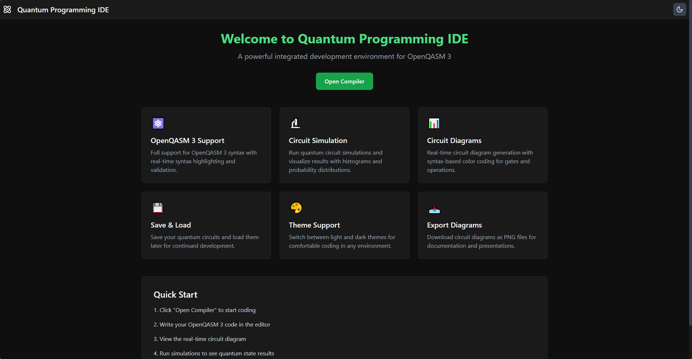
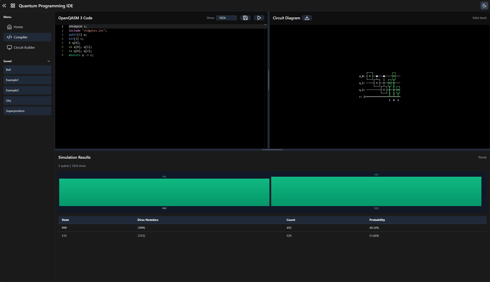

# Quantum Programming IDE Compiler & Simulator

A comprehensive web-based platform for compiling, simulating, and visualizing quantum circuits written in OpenQASM 3. This application provides researchers and academics with an intuitive interface for quantum algorithm development, circuit analysis, and educational purposes.

## Overview

This project implements a full-stack quantum computing development environment that combines the OpenQASM 3 specification with Qiskit's simulation capabilities. The platform features a modern, responsive web interface that enables real-time circuit visualization, interactive simulation, and comprehensive result analysis.

### Screenshots

**Home Page:**


**Compiler Page:**


### Key Features

- **OpenQASM 3 Compliance**: Full support for OpenQASM 3 syntax including qubit/bit registers, gate operations, measurements, and control flow constructs
- **Visual Circuit Builder**: Drag-and-drop interface for building quantum circuits visually with real-time QASM code generation
- **Quantum Circuit Simulation**: High-performance local simulation using Qiskit's AerSimulator with configurable shot counts
- **Real-time Visualization**: Dynamic circuit diagram generation with SVG rendering and text-based fallback
- **Interactive Results Analysis**: Statistical visualization through histograms and detailed measurement count tables
- **Advanced Language Features**: Support for loop expansion, conditional statement handling, and register-to-register operations
- **Modern Web Interface**: Responsive design with dark/light theme support, collapsible navigation, and drag-and-drop file loading
- **Persistent Storage**: Local file management system for saving and organizing quantum circuit definitions
- **Standalone Executable**: PyInstaller support for creating portable, single-file executables with all dependencies bundled
- **Offline Capable**: Local Tailwind CSS and all assets included - no external CDN dependencies required
- **Advanced Code Editor**: Monaco Editor with OpenQASM 3 syntax highlighting, real-time error detection, and color-coded gate types
- **Interactive Circuit Visualization**: Multi-color circuit diagrams matching code syntax highlighting (blue for measure, cyan for gates, yellow for functions)
- **Resizable Panels**: Adjustable code editor and circuit diagram sections with persistent layout preferences
- **Dirac Notation Display**: Quantum state representation in standard bra-ket notation (|000⟩, |001⟩, etc.)

## Architecture

### Technology Stack

- **Backend**: Python 3.10+, Flask (web framework)
- **Quantum Framework**: Qiskit, Qiskit Aer (simulation)
- **Parser**: OpenQASM 3 parser with AST generation
- **Frontend**: HTML5, TailwindCSS (local), Vanilla JavaScript
- **Code Editor**: Monaco Editor (VS Code editor engine) with custom OpenQASM 3 language support
- **Visualization**: Matplotlib (circuit diagrams), Canvas API (histograms)
- **Distribution**: PyInstaller (standalone executable creation)

### Project Structure

```
Quantum_Programming_IDE/
│
├── backend/
│   ├── app.py                 # Flask application entry point
│   ├── compiler/
│   │   ├── parser.py          # OpenQASM 3 parsing and AST generation
│   │   ├── executor.py        # Compilation and simulation orchestration
│   │   └── simulator.py       # Circuit building and quantum simulation
│   ├── utils/
│   │   └── errors.py          # Custom exception handling
│   └── requirements.txt       # Python dependencies
│
├── frontend/
│   ├── templates/
│   │   ├── home.html          # Home page interface
│   │   ├── compiler.html     # Compiler application interface
│   │   └── circuit.html      # Circuit builder interface
│   └── static/
│       ├── css/
│       │   └── styles.css     # Custom styling and theme definitions
│       ├── js/
│       │   ├── app.js         # Frontend application logic
│       │   ├── circuit-builder.js # Circuit builder drag-and-drop functionality
│       │   └── tailwind.min.js # Local Tailwind CSS (offline support)
│       └── Saved/              # User-saved quantum circuit files
│
├── setup.bat                   # Windows setup script
├── start.bat                   # Windows start script
├── compile.bat                 # PyInstaller build script for standalone executable
├── QuantumIDE.spec             # PyInstaller specification file
└── README.md                   # This file
```

## Installation

### Prerequisites

- Python 3.10 or higher
- pip (Python package manager)
- Modern web browser (Chrome, Firefox, Edge, Safari)
- Windows 10/11 (for provided batch scripts) or Unix-like system (manual setup)

### Automated Setup (Windows)

1. **Initial Setup**:

   ```batch
   setup.bat
   ```

   This script creates a Python virtual environment and installs all required dependencies.

2. **Start the Server**:
   ```batch
   start.bat
   ```
   The application will be available at `http://127.0.0.1:5010`

### Manual Setup

1. **Create Virtual Environment**:

   ```bash
   python -m venv .venv
   ```

2. **Activate Virtual Environment**:

   ```bash
   # Windows
   .venv\Scripts\activate

   # Linux/macOS
   source .venv/bin/activate
   ```

3. **Install Dependencies**:

   ```bash
   pip install -r backend/requirements.txt
   ```

4. **Run Application**:

   ```bash
   cd backend
   python app.py
   ```

   The application will be available at `http://127.0.0.1:5010`

### Building Standalone Executable

The project includes PyInstaller support for creating a single-file, portable executable that includes all dependencies and can run without Python installation.

#### Prerequisites for Building

- Python 3.10 or higher
- All project dependencies installed (run `setup.bat` first)
- PyInstaller (automatically installed by `compile.bat`)

#### Building the Executable

1. **Using the automated script** (recommended):

   ```batch
   compile.bat
   ```

   This script will:

   - Check for and install PyInstaller if needed
   - Clean previous builds
   - Build the executable using the optimized `QuantumIDE.spec` configuration
   - Create `dist/QuantumIDE.exe`

2. **Using PyInstaller directly**:
   ```batch
   pyinstaller QuantumIDE.spec
   ```

#### Executable Features

- **Single File**: All dependencies bundled into one executable
- **Portable**: Can be distributed without Python installation
- **Offline Capable**: Includes local Tailwind CSS and all assets
- **Smart Path Handling**: Automatically handles template/static file paths
- **User Data**: Saved files are stored next to the executable (not in temp folders)

#### Running the Executable

Simply double-click `dist/QuantumIDE.exe` or run it from the command line:

```batch
dist\QuantumIDE.exe
```

The application will start and be available at `http://127.0.0.1:5010`. User-saved quantum circuit files will be stored in a `Saved` folder next to the executable.

## Usage

### Basic Workflow

#### Using the Code Editor

1. **Access the Compiler**: Navigate to `http://127.0.0.1:5010/compiler` in your web browser
2. **Write OpenQASM 3 Code**: Enter your quantum circuit definition in the code editor
3. **Configure Simulation**: Set the number of measurement shots (default: 1024)
4. **Execute Simulation**: Click "Run Simulation" or press `Ctrl+Enter`
5. **Analyze Results**: Review the histogram visualization and measurement statistics

#### Using the Circuit Builder

1. **Access the Circuit Builder**: Navigate to `http://127.0.0.1:5010/circuit` in your web browser
2. **Add Qubits**: Use the "+ Qubit" button to add qubits to your circuit
3. **Drag Gates**: Drag gates from the palette on the left sidebar onto the circuit canvas
4. **Position Gates**: Drop gates on qubit lines at desired column positions
5. **Move Gates**: Click and drag existing gates to reposition them
6. **View Generated Code**: Watch the QASM code update in real-time on the right side
7. **Run Simulation**: Click "Run" to execute the circuit and view results
8. **Save Circuit**: Save the generated QASM code for future use

### OpenQASM 3 Syntax Support

The compiler supports the following OpenQASM 3 constructs:

- **Declarations**: `qubit[n]`, `bit[n]` register declarations
- **Standard Gates**: H, X, Y, Z, S, T, CX, CY, CZ, CH, SWAP, CCX, CSWAP
- **Measurements**: Register-to-register (`measure q -> c`) and indexed measurements
- **Control Flow**: `for` loops with automatic expansion, `if/else` conditionals (noted in circuit building)
- **Includes**: Standard gate library inclusion (`include "stdgates.inc"`)

### Example Circuits

#### Bell State (Entangled Pair)

```openqasm
OPENQASM 3;
include "stdgates.inc";
qubit[2] q;
bit[2] c;
h q[0];
cx q[0], q[1];
measure q -> c;
```

#### GHZ State (3-Qubit Entanglement)

```openqasm
OPENQASM 3;
include "stdgates.inc";
qubit[3] q;
bit[3] c;
h q[0];
cx q[0], q[1];
cx q[0], q[2];
measure q -> c;
```

#### Superposition

```openqasm
OPENQASM 3;
include "stdgates.inc";
qubit[1] q;
bit[1] c;
h q[0];
measure q -> c;
```

### File Management

The platform provides comprehensive file management capabilities:

- **Loading Files**: Drag and drop `.qasm` or `.qasm3` files directly into the code editor for immediate loading
- **Saving Circuits**: Save quantum circuit definitions with custom filenames through the integrated save interface
- **File Organization**: Dynamic discovery and listing of all `.qasm` files in the Saved directory
- **File Operations**:
  - **Rename**: Edit filenames through an intuitive interface with validation
  - **Download**: Export circuit definitions to local storage
  - **Delete**: Remove files with confirmation prompts to prevent accidental data loss
- **Persistent Storage**: All saved files are stored locally in `frontend/static/Saved/` for persistent access across sessions

## API Reference

### REST Endpoints

#### `GET /`

Redirects to the home page (`/home`).

#### `GET /home`

Serves the home page with feature overview and navigation.

#### `GET /compiler`

Serves the compiler interface with code editor, circuit diagram, and simulation results.

#### `GET /circuit`

Serves the circuit builder interface with drag-and-drop gate palette, visual circuit canvas, and real-time QASM code generation.

#### `POST /compile`

Compiles and simulates OpenQASM 3 code.

**Request Body:**

```json
{
  "code": "OPENQASM 3; ...",
  "shots": 1024
}
```

**Success Response (200):**

```json
{
  "success": true,
  "qubits": 2,
  "shots": 1024,
  "counts": {
    "00": 512,
    "11": 512
  }
}
```

**Error Response (400/500):**

```json
{
  "success": false,
  "error": "Error message description"
}
```

#### `POST /circuit-diagram`

Generates a visual representation of the quantum circuit.

**Request Body:**

```json
{
  "code": "OPENQASM 3; ..."
}
```

**Success Response (200):**

```json
{
  "success": true,
  "svg": "<svg>...</svg>"
}
```

or

```json
{
  "success": true,
  "text": "Circuit text representation",
  "format": "text"
}
```

#### `GET /saved-files`

Retrieves a list of available saved quantum circuit files.

**Success Response (200):**

```json
{
  "success": true,
  "files": [
    {
      "filename": "bell.qasm",
      "name": "Bell"
    }
  ]
}
```

#### `POST /save-file`

Saves OpenQASM 3 code to a file in the Saved directory.

**Request Body:**

```json
{
  "filename": "my_circuit.qasm",
  "code": "OPENQASM 3; ...",
  "overwrite": false
}
```

**Success Response (200):**

```json
{
  "success": true,
  "message": "File 'my_circuit.qasm' saved successfully"
}
```

**Error Response (400/409/500):**

```json
{
  "success": false,
  "error": "Error message",
  "exists": true
}
```

#### `POST /check-file-exists`

Checks whether a file exists in the Saved directory.

**Request Body:**

```json
{
  "filename": "my_circuit.qasm"
}
```

**Success Response (200):**

```json
{
  "exists": true
}
```

#### `POST /delete-file`

Deletes a file from the Saved directory.

**Request Body:**

```json
{
  "filename": "my_circuit.qasm"
}
```

**Success Response (200):**

```json
{
  "success": true,
  "message": "File 'my_circuit.qasm' deleted successfully"
}
```

#### `POST /rename-file`

Renames a file in the Saved directory.

**Request Body:**

```json
{
  "oldFilename": "old_name.qasm",
  "newFilename": "new_name"
}
```

**Success Response (200):**

```json
{
  "success": true,
  "message": "File renamed from 'old_name.qasm' to 'new_name.qasm' successfully"
}
```

## Implementation Details

### Architecture Design

The system follows a modular architecture with clear separation of concerns:

- **Frontend Layer**: Handles user interaction, real-time visualization, and state management
- **Backend API**: Provides RESTful endpoints for compilation, simulation, and file management
- **Compiler Module**: Processes OpenQASM 3 syntax and generates circuit representations
- **Simulator Module**: Executes quantum circuits and aggregates measurement statistics

### Circuit Building Methodology

The simulator employs a direct circuit construction approach that bypasses QASM 2.0 conversion limitations, which often fail to handle modern OpenQASM 3 constructs. The `build_circuit_from_qasm3()` function implements the following algorithm:

1. **Register Parsing**: Extracts qubit and classical bit register declarations, maintaining mappings between register names and Qiskit circuit indices
2. **Loop Expansion**: Expands `for` loops by performing variable substitution, converting loop variables to concrete qubit/bit indices through pattern matching and brace analysis
3. **Conditional Handling**: Identifies `if/else` conditional blocks and annotates them in the circuit (noted as runtime-dependent operations that cannot be statically determined)
4. **Gate Mapping**: Translates OpenQASM 3 gate operations to corresponding Qiskit `QuantumCircuit` methods using a comprehensive gate mapping table
5. **Measurement Processing**: Handles both register-to-register measurements (`measure q -> c`) and indexed measurements (`measure q[i] -> c[i]`)

### Simulation Pipeline

The simulation process follows a well-defined pipeline:

1. **Lexical Analysis**: OpenQASM 3 code is tokenized and parsed into an abstract syntax tree (AST) using the `openqasm3` parser library
2. **Circuit Construction**: A Qiskit `QuantumCircuit` object is built programmatically from the parsed AST, maintaining register mappings and gate dependencies
3. **Validation**: The circuit is validated to ensure proper qubit/bit counts, measurement operations, and gate compatibility
4. **Transpilation**: The circuit is transpiled and optimized for the target simulator backend (AerSimulator)
5. **Execution**: AerSimulator executes the circuit with the specified number of measurement shots
6. **Result Aggregation**: Measurement counts are collected, normalized, and formatted for statistical analysis

### Error Handling and Robustness

The application implements comprehensive error handling with graceful degradation:

- **CompilationError**: Catches and reports syntax errors, semantic violations, and unsupported OpenQASM 3 constructs
- **SimulationError**: Handles runtime errors during circuit execution, measurement failures, and simulator backend issues
- **Graceful Degradation**: Falls back to text-based circuit diagrams when SVG generation fails, ensuring visualization remains available
- **Input Validation**: All user inputs are sanitized to prevent path traversal attacks and invalid file operations

## Research Applications

This platform is designed to support various research and educational activities in quantum computing:

### Algorithm Development and Prototyping

- Rapid prototyping and iterative development of quantum algorithms
- Testing and validation of quantum circuit designs before hardware deployment
- Comparative analysis of different algorithmic approaches

### Educational and Pedagogical Use

- Teaching quantum computing concepts, gate operations, and measurement theory
- Demonstrating OpenQASM 3 syntax and quantum circuit specification
- Interactive exploration of quantum entanglement, superposition, and interference phenomena
- Hands-on learning through circuit visualization and statistical analysis

### Circuit Analysis and Verification

- Visual inspection and verification of quantum circuit correctness
- Analysis of gate sequences and their effects on quantum states
- Validation of circuit designs against theoretical expectations

### Performance Evaluation and Benchmarking

- Statistical analysis of quantum circuit behavior across multiple measurement shots
- Evaluation of circuit performance characteristics and measurement distributions
- Comparative studies of different circuit implementations

### Research Prototyping

- Quick iteration on quantum circuit designs without hardware access
- Experimental exploration of novel quantum algorithms and gate sequences
- Development of quantum software components and subroutines

## Limitations and Future Work

### Current Limitations

The current implementation has several limitations that reflect the complexity of full OpenQASM 3 support:

- **Conditional Statements**: `if/else` conditional blocks are identified but not fully executed during static circuit building, as they depend on runtime classical register values
- **Gate Set**: Limited to standard gates (H, X, Y, Z, S, T, RX, RY, RZ, CX, CY, CZ, CH, SWAP, CCX, CSWAP, Measure) compared to the full OpenQASM 3 specification
- **Parameterized Gates**: Basic support for parameterized gates (RX, RY, RZ) in circuit builder, but limited parameter editing after placement
- **Classical Computation**: Limited classical computation support; classical operations are primarily used for measurement storage
- **Hardware Integration**: Local simulation only; no direct connection to quantum hardware backends
- **Circuit Builder**: Multi-qubit gates automatically select adjacent qubits as targets; manual target selection not yet implemented

### Potential Enhancements

Future development directions include:

- **Extended Language Support**: Full OpenQASM 3 feature support including parameterized gates, user-defined gates, and comprehensive classical computation
- **Hardware Backend Integration**: Integration with quantum hardware providers (IBM Quantum, AWS Braket, Google Quantum AI) for real device execution
- **Advanced Optimization**: Circuit optimization and transpilation options with configurable optimization levels and target device constraints
- **Collaboration Features**: Multi-user collaboration capabilities with shared workspaces and version control
- **Export and Documentation**: Enhanced export capabilities including high-resolution circuit images, QASM file generation, and LaTeX circuit representations
- **Performance Analysis**: Advanced performance profiling and benchmarking tools with detailed timing and resource utilization metrics
- **Error Mitigation**: Integration of error mitigation techniques and noise modeling for more realistic simulation results

## Contributing

This project welcomes contributions from the research and academic community. Areas of particular interest for contributions include:

- **Extended Gate Set**: Implementation of additional OpenQASM 3 gates and gate definitions
- **Performance Optimizations**: Improvements to circuit building, simulation speed, and memory efficiency
- **Visualization Enhancements**: Additional visualization options, interactive circuit editing, and advanced result presentation
- **Educational Content**: Development of tutorial examples, educational circuits, and documentation materials
- **Documentation Improvements**: Enhancement of API documentation, user guides, and technical specifications
- **Testing and Validation**: Expansion of test coverage, validation suites, and correctness verification

Contributors are encouraged to follow best practices for code quality, documentation, and testing. Please ensure that all contributions maintain the academic and professional standards of the project.

## Dependencies

### Backend Dependencies

- **Flask** (2.0+): Web framework for RESTful API endpoints
- **Qiskit** (0.45+): Quantum circuit construction and simulation framework
- **Qiskit Aer**: High-performance quantum circuit simulator
- **openqasm3[parser]** (0.5.0): OpenQASM 3 parser with AST generation
- **matplotlib**: Circuit diagram visualization and SVG generation
- **numpy**: Numerical computations for quantum state manipulation

### Frontend Dependencies

- **TailwindCSS**: Utility-first CSS framework for responsive design (included locally - no CDN required)
- **Vanilla JavaScript**: No external JavaScript frameworks required

### Build Dependencies

- **PyInstaller**: For creating standalone executables (optional, for distribution)

## License

MIT License

## Citation

If you use this software in your research or academic work, please cite:

```bibtex
@software{Quantum_Programming_IDE,
  title = {Quantum Programming IDE},
  author = {Sayid Bajrai Abdul Nasir},
  year = {2026},
  url = {https://github.com/SayidBajrai/Quantum_Programming_IDE},
  version = {1.0.3}
}
```

## Acknowledgments

The development of this platform was made possible by the following open-source projects and communities:

- **Qiskit Development Team**: For providing the comprehensive quantum simulation framework and tools
- **OpenQASM 3 Specification Contributors**: For establishing the OpenQASM 3 standard and parser implementations
- **Open Source Community**: For the extensive ecosystem of tools and libraries that form the foundation of this project

## Contact and Support

For questions, technical issues, collaboration inquiries, or research partnerships, please contact:

- **Issues**: https://github.com/SayidBajrai/Quantum_Programming_IDE
- **Research Inquiries**: sayidbajrai@gmail.com

## References

1. **Cross, A. W., Bishop, L. S., Smolin, J. A., & Gambetta, J. M.**  
   _OpenQASM 3: A broader and deeper quantum assembly language_.  
   arXiv preprint arXiv:2104.14722, 2021.  
   [https://arxiv.org/abs/2104.14722](https://arxiv.org/abs/2104.14722)

2. **IBM Quantum**  
   _OpenQASM 3 Language Reference and Documentation_.  
   IBM Quantum, 2023.  
   [https://openqasm.com](https://openqasm.com/)

3. **Cross, A. W., Gambetta, J. M., Bishop, L. S., et al.**  
   _Validating quantum circuits on real hardware_.  
   Physical Review A, 100(3), 032328, 2019.  
   [https://arxiv.org/abs/1812.09072](https://arxiv.org/abs/1812.09072)

4. **Sivarajah, S., Dilkes, S., Cowtan, A., et al.**  
   _t|ket⟩: A retargetable compiler for NISQ devices_.  
   Quantum Science and Technology, 6(1), 014003, 2020.  
   [https://arxiv.org/abs/2003.10611](https://arxiv.org/abs/2003.10611)

5. **Nation, P. D., Treinish, M., Gambetta, J. M., et al.**  
   _Dynamic circuits on IBM Quantum hardware_.  
   arXiv preprint arXiv:2107.03545, 2021.  
   [https://arxiv.org/abs/2107.03545](https://arxiv.org/abs/2107.03545)

6. **Peruzzo, A., McClean, J., Shadbolt, P., et al.**  
   _A variational eigenvalue solver on a photonic quantum processor_.  
   Nature Communications, 5, 4213, 2014.  
   [https://arxiv.org/abs/1304.3061](https://arxiv.org/abs/1304.3061)

7. **Farhi, E., Goldstone, J., & Gutmann, S.**  
   _A quantum approximate optimization algorithm_.  
   arXiv preprint arXiv:1411.4028, 2014.  
   [https://arxiv.org/abs/1411.4028](https://arxiv.org/abs/1411.4028)

8. **Temme, K., Bravyi, S., & Gambetta, J. M.**  
   _Error mitigation for short-depth quantum circuits_.  
   Physical Review Letters, 119(18), 180509, 2017.  
   [https://arxiv.org/abs/1612.02058](https://arxiv.org/abs/1612.02058)

9. **Microsoft Quantum Team**  
   _Q#: A domain-specific programming language for quantum computing_.  
   Microsoft Azure Quantum Documentation, 2022.  
   [https://learn.microsoft.com/azure/quantum/](https://learn.microsoft.com/azure/quantum/)

10. **Hernandez, O., Javadi-Abhari, A., Kissinger, A., et al.**  
    _Guppy: A Pythonic quantum programming language_.  
    arXiv preprint arXiv:2304.15000, 2023.  
    [https://arxiv.org/abs/2304.15000](https://arxiv.org/abs/2304.15000)

## Version History

- **v1.0.4** (2026-01-16): Visual Circuit Builder with drag-and-drop interface

  - Added `/circuit` route for visual circuit builder page
  - Drag-and-drop gate palette with single-qubit and multi-qubit gates
  - Visual circuit canvas with SVG rendering
  - Real-time QASM code generation from circuit structure
  - Gate repositioning with click-and-drag functionality
  - Parameter preservation when moving gates
  - Qubit management (add/remove qubits)
  - Non-editable code editor showing generated QASM code
  - Circuit builder navigation links on home and compiler pages

- **v1.0.3** (2026-01-16): Multi-page navigation and enhanced circuit diagram features

  - Added home page with feature overview and navigation
  - Separated compiler interface into dedicated page
  - Enhanced syntax highlighting with function-like gates (measure, reset) in distinct colors
  - Circuit diagram color coding matching Monaco editor theme
  - PNG circuit diagram download using matplotlib backend
  - Improved route structure with `/home` and `/compiler` endpoints

- **v1.0.2** (2026-01-16): Advanced syntax highlighting and circuit visualization

  - Enhanced OpenQASM 3 syntax highlighting with color-coded gate types
  - Function-like gates (h, cx, ry) highlighted in yellow-green
  - Measure and reset gates highlighted in light green
  - User-defined functions highlighted in yellow
  - Keywords (qubit, bit, include, let, gate) in dark blue
  - Control flow keywords (break, continue, return) in purple
  - Circuit diagram colors synchronized with editor theme

- **v1.0.1** (2026-01-15): Enhanced user interface and code editor features

  - Monaco Editor integration with syntax highlighting
  - Real-time syntax error detection
  - Multi-color circuit diagram visualization (text and SVG)
  - Resizable code editor and circuit diagram panels
  - Dirac notation column in simulation results table
  - Improved color scheme matching code syntax highlighting

- **v1.0.0** (2026-01-13): Initial release with core compilation, simulation, and visualization features
  - PyInstaller support for standalone executable distribution
  - Local Tailwind CSS for offline operation
  - Enhanced path handling for compiled executables
  - Improved file management with proper Saved directory handling

---

**Version**: 1.0.4
**Last Updated**: 2026-01-16
